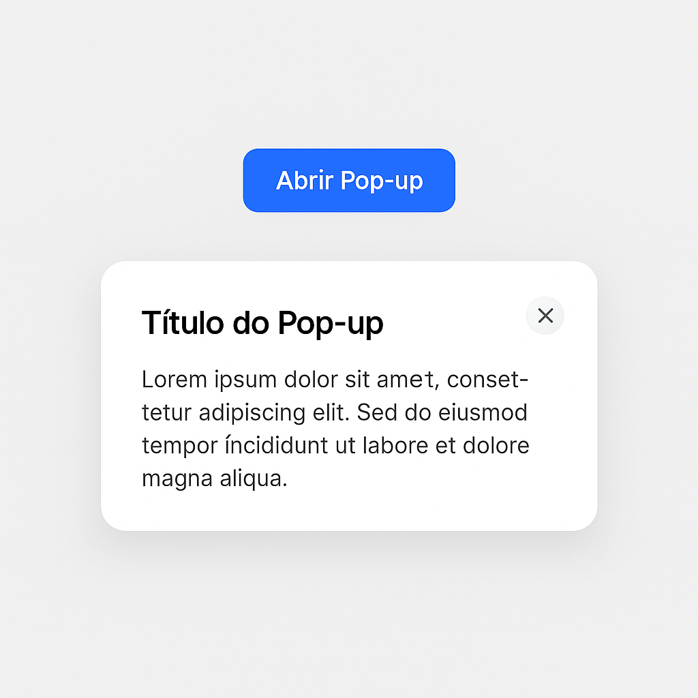

# Deasafio: Componente Pop-up Acessível

## Objetivo

Criar um componente de **pop-up(modal)** reutilável, acessível e com foco em boas práticas semânticas, transições suaves e controle via JavaScript. Ideal para alertas, mensagens e formulários.

## Escopo do Projeto

**Você foi contratado por uma empresa para desenvolver um componente de pop-up reutilável**. Ele será utilizado em múltiplas seções do site, tanto para mensagens informativas quanto formulários.

## Funcionalidades Obrigatórias

- [ ] Ao clicar em um botão, o pop-up deve abrir centralizado.
- [ ] Deve ter um fundo escurecido (overlay).
- [ ] O foco do teclado deve ser movido para o modal ao abrir.
- [ ] O botão "Fechar" deve fechar o modal.
- [ ] O modal pode ser fechado também pressionando `ESC` ou clicandofora dele.
- [ ] O conteúdo do modal devser acessível:
  - Atributo `aria-modla="true"`
  - Atributo `role="dialog"`
  - Atributo `aria-lablledby` para o título
  - Atributo `aria-labelledby` para a descrição
- [ ] Deve ser possível abrir múltiplos tipos de modal com conteúdos diferentes (reutilável).
- [ ] Transição suave na abertura.
- [ ] Prevenir que a rolagem da página de fundo ocorra enquanto o modal está aberto.

## Imagem: Figma

    

