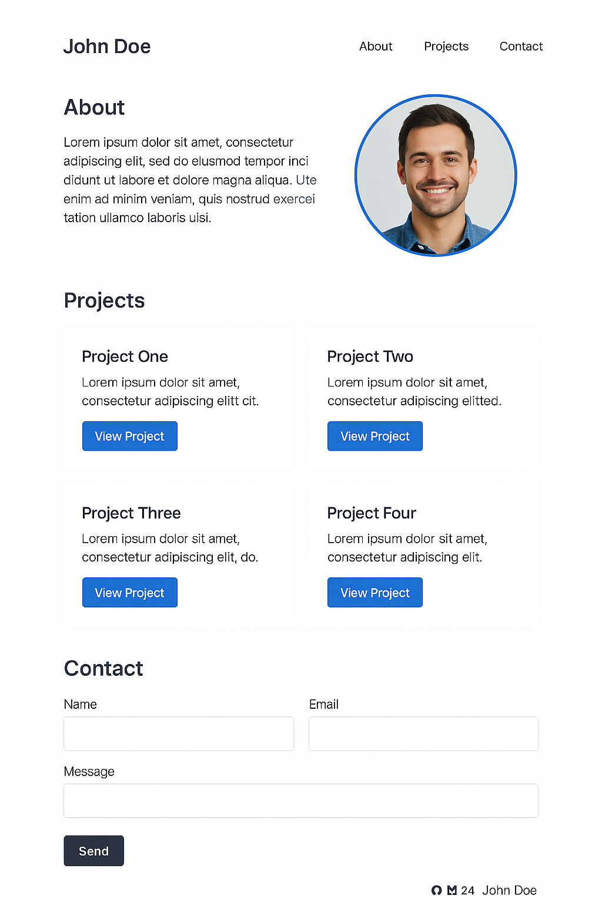

# 📦 Desafio CSS Grid — Layout Responsivo de Portfólio Pessoal

## 🎯 Objetivo

Construir uma página web responsiva para um portfólio pessoal, utilizando **CSS Grid** para estruturar o layout principal da página. O foco é aplicar conceitos avançados de Grid, alinhamento, áreas nomeadas, fracionamento (`fr`), e responsividade com media queries.

## 📝 Funcionalidades Obrigatórias

- **Cabeçalho (Header)**: com nome/logo e menu de navegação horizontal.
- **Seção Principal (Main)** com 3 áreas:
  - **Sobre**: um bloco com textos e uma foto circular do usuário.
  - **Projetos**: grid com cards de projetos (mínimo 4), cada card com título, descrição e link.
  - **Contato**: formulário simples com nome, email e mensagem.
- **Rodapé (Footer)**: contendo rede sociais e copyright.
- O layout da página deve ser contruído usando **CSS Grid** (não Flexbox para a estrutura principal)
- O grid deve ser responsivo: em telas menores que 768px, as áreas devem empilhar verticalmente; em telas maiores, usar grid com colunas e linhas conforme o layout do Figma
- Utilizar **áreas nomeadas** (`grid-template-areas) para organizar as seções no grid.

## 💻 Requisitos Técnicos

- HTML semântico e acessível.
- CSS Grid para o layout principal, com uso adequado das propriedades: `grid-template-columns`, `grid-template-rows`, `grid-template-areas`, `gap`, `fr`, `minmax()`, etc.
- Responsividade com media queries.
- Imagens responsivas (usar `max-width: 100%` e `height: auto`).
- Formulários funcional (não precisa enviar dados, mas com validação básica de HTML5).

## 📌 Figma

  

