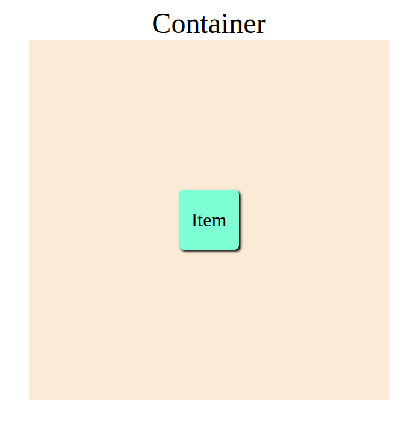
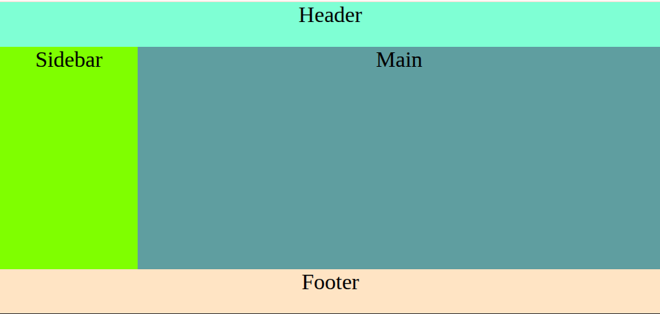

# Exercícios - CSS Grid

---

## 1. Crie uma Grid com 3 colunas fixas

**Objetivo:** Criar um grid com **3 colunas de 100px cada** e **3 linhas automáticas**.

- Use uma `div.container` com grid.
- Adicione 9 `div.item` coo filhos.
- Cada item deve ter cor de fundo diferente.

📌 _Você deve usar `display: grid` e `grid-template-columns`._

### Resposta

    

---

## 2. Crie uma Grid com colunas responsivas

**Objetivo:** Crie uma grid com **colunas automáticas** que se ajustam ao tamanho da tela.

- Use ´repeat(auto-fit, minmax(150px, 1fr))`
- Coloque ao menos 10 items filhos com altura de 100px
- Adicione `gap` entre os elementos.

### Resposta: Para uma tela de 912 x 1368

    

---

## 3. Centeralize um item usando Grid

**Objetivo:** Usar CSS Grid para centralizar um único item **horizontal e verticalmente**.

- Use uma `div.container` com largura e altura fixas.
- Dentro dela, um único `div.item` com 100x100px.
- Use Grid para centralizar este item.

### Resposta

    

---

## 4. Use `grid-area` para nomear áreas

**Objetivo:** Criar um layout com áreas nomeadas usando `grid-template-área`

- Estrutura: header, sidebar, main, footer
- Formato: `
header header
sidebar main
footer footer`

- Defina as áreas e associe cada elemento com `grid-area`

### Resposta

    

