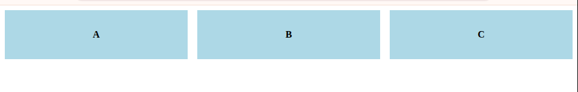

# 📘 CSS Grid Layout --- A Grade de Layout Bidemensional do CSS

## 🧱 1. Po que usar CSS Grid?

Antes do Grid, layouts eram feitos com:

- floats e `position` (difícil e manual)
- Flexbox (ótimo, mas unidimensional --- ou linha ou coluna)

## 🧩 2. O que é uma grade?

Imagine uma folha quadriculada. 0 **CSS Grid** transforma um container em uma **malha invisível de linhas e colunas**, como um tabuleiro de xadrez.

Essa malha é formada por:

| Conceito   | Explicação                                                               |
| ---------- | ------------------------------------------------------------------------ |
| Grid Line  | Linhas verticais ou horizontais que delimitam a grade                    |
| Grid Track | Faixa entre duas linhas (ou seja, uma **linha ou coluna** real)          |
| Grid Cell  | A menor unidade: a célula de uma grade (como uma célula de planilha)     |
| Grid Area  | Um bloco de células que você pode nomear e ocupar com um item específico |

## 🔧 3. Criando um container Grid

```css
.conatiner {
  display: grid;
}
```

## 📐 4. Definindo colunas e linhas

```css
.conatiner {
  display: grid;
  grid-template-columns: 200px 1fr 100px;
  grid-template-rows: auto auto;
}
```

### Explicando:

- `grid-template-columns`: cria **3 colunas**
  - primeira com `200px`
  - segunda com `1fr` -> espaço proporcional
  - terceira com `100px`
- `grid-template-rows`: cria **2 linhas**
  - altura automática conforme o conteúdo

## ✨ 6. Exemplo visual básico

### HTML

```html
<div class="grid">
  <div class="item">A</div>
  <div class="item">B</div>
  <div class="item">C</div>
</div>
```

### CSS

```css
.grid {
  display: grid;
  grid-template-columns: repeat(3, 1fr);
  gap: 1rem;
}

.item {
  background: lightblue;
  padding: 2rem;
  text-align: center;
  font-weight: bold;
}
```

### Resultado

<p align="center">
    
</p>

## 🧠 7. Como o Grid posiciona os itens?

Por padrão, os itens são inseridos da esquerda para a direita, e quebram para a próxima linha quando necessário.

Mas você pode \*\*posicionar manualmente com:

```css
.item {
  grid-column: 2/4;
  grid-row: 1/3;
}
```

Significa:

- vai da coluna 2 até amtes da 4 (ou seja, ocupa colunas 2 e 3)
- vai da linha 1 até antes da 3 (ou seja, ocupa linhas 1 e 2)

## 🔤 8. Nomes para áreas da grade

Você pode nomear áreas com `grid-template-areas`:

```css
.container {
  display: grid;
  grid-template-columns: 1fr 3fr;
  grid-template-rows: auto 1fr auto;
  grid-templates-areas: 'header header' 'sidebar main' 'footer footer';
}
.header {
  grid-area: header;
}
.sidebar {
  gride-area: sidebar;
}
```

## 🧭 9. Auto-placement vs. manual

O Grid tenta **colocar os elementos automaticamente**, mas você pode assunmir controle total com:

- `grid-column`
- `grid-row`
- `grid-area`

## 📏 10. Gaps, alinhamento e responsividade

```css
.container {
  gap: 1rem;
  justify-items: center;
  align-items: stretch;
}
```

Responsividade com Grid é natural. Exemplo:

```css
grid-template-columns: repeat(auto-fit, minmax(200px, 1fr));
```

Isso cria **colunas flexíveis**, com no mínimo 200px, que se reorganizam automaticamente em telas menores.
